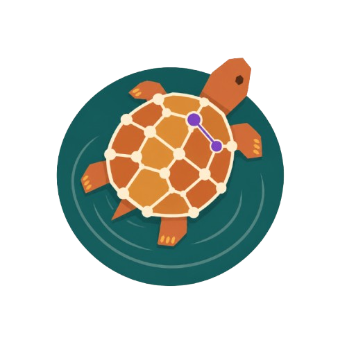

<p align="center">
  
</p>

<h1 align="center">turtlelake</h1>

<p align="center">
  <strong>An embedded RDF + vector store for local AI agents.</strong><br/>
  One directory on disk. SPARQL, GraphRAG, and atomic versioning. Ready to plug into any MCP-aware agent.
</p>

<p align="center">
  <a href="https://www.python.org/downloads/"></a>
  <a href="#license"></a>
  <a href="#project-status"></a>
  <a href="https://lancedb.github.io/lance/"></a>
</p>

---

## The problem

You're building an AI agent that needs to ground its answers in real, structured knowledge -- a medical ontology, a legal taxonomy, a company's product catalog, an ontology of regulations. Today, that means stitching together at least three things:

- a **vector database** for "find the entity that matches this query" (Pinecone, Chroma, LanceDB, ...),
- a **graph or triple store** for "give me the surrounding facts" (Neo4j, GraphDB, Oxigraph, ...),
- and your **own glue code** to keep their version histories in sync, redeploy them, and authenticate the agent into both.

For a single-developer prototype or a regulated deployment that needs reproducibility, this is too much infrastructure. You want one local artifact, one set of credentials (none), and one tag namespace shared across the vectors *and* the graph.

## What turtlelake is

A single Python package that turns a directory on disk into a queryable knowledge graph with vectors built in:

```
my_kg.turtlelake/
├── triples.lance/        ← RDF quads as Arrow columns + Lance versions/tags
├── embeddings.lance/     ← per-IRI vectors with the same versioning
├── manifest.json         ← paired-checkpoint write-ahead log
└── prefixes.ttl          ← optional namespace shorthands
```

You open it from Python or expose it to an LLM agent over **MCP** (Model Context Protocol -- the same wire format Claude Desktop and Cursor speak natively). The agent gets one set of tools to discover the graph, query it with SPARQL, walk it by entity, search by vector, validate against SHACL shapes, and atomically roll back any write it doesn't like.

> The name: `.ttl` is the file extension for **Turtle** (the canonical RDF serialization). turtlelake is a *lake* of Turtle.

## When to reach for it (and when not to)

| Use turtlelake when... | Look elsewhere when... |
|---|---|
| You need RDF + vectors + versioning in one local artifact | You only need vectors at billion scale (use Faiss / HNSW) |
| Your agent runs locally or in a single container | You need a clustered, multi-writer triple store (use GraphDB / Stardog) |
| Reproducibility matters -- same bytes, same answers | You need an OWL2-DL reasoner in the loop (delegate to owlrl / Open Ontologies) |
| You want SHACL validation on agent writes | Your data is unstructured text only and shape doesn't matter |

---

## 60-second quick start

```bash
git clone https://github.com/archloom/turtlelake.git
cd turtlelake
pip install -e ".[mcp,shacl]"
```

```python
from turtlelake import Dataset

kg = Dataset.open("my_kg.turtlelake")
kg.insert_turtle('''
    @prefix ex: <https://ex.org/> .
    ex:foundation a ex:Book ; ex:title "Foundation" ; ex:author ex:asimov .
''')

# Plain SPARQL 1.1
for row in kg.query("SELECT ?title WHERE { ?b ex:title ?title }",
                    prefixes={"ex": "https://ex.org/"}):
    print(row["title"]["value"])

# Tag this state. You can roll back to it later, atomically across triples + vectors.
kg.tag("baseline")
```

To launch the agent-facing MCP server:

```bash
turtlelake-mcp                                 # speaks JSON-RPC over stdio
# or, equivalently:
python -m turtlelake.mcp_server
```

Point Claude Desktop, Cursor, or any MCP client at that command and the agent gets 25 tools to drive the graph.

---

## Walkthrough -- agent grounds a clinical claim against the Disease Ontology

This is the kind of workflow turtlelake exists for: an LLM agent has a natural-language clinical statement, and we don't want it to hallucinate disease codes, miss subtypes, or mismap to the wrong taxonomy. The agent uses MCP tools to *ground* every step against a real public ontology.

The full example lives in [`examples/demo_medical_doid.py`](./examples/demo_medical_doid.py). Here we walk through what it would look like as an MCP conversation between an agent (e.g. Claude) and `turtlelake-mcp`. Each turn is a real JSON-RPC frame the agent sends and the server returns.

### Setup -- load the ontology once

The agent ingests the Disease Ontology (DOID) cancer slim from a local file:

```jsonc
// agent → server
{
  "jsonrpc": "2.0", "id": 1,
  "method": "tools/call",
  "params": {
    "name": "ingest",
    "arguments": { "path": "/data/DO_cancer_slim.owl",
                   "source": "doid:cancer-slim",
                   "author": "Disease Ontology" }
  }
}

// server → agent
{ "jsonrpc": "2.0", "id": 1,
  "result": { "content": [{ "type": "text",
              "text": "ingested 41872 quads; dataset now has 41872 rows" }] } }
```

### The user input

> "Patient has acute lymphoblastic leukemia."

A naive LLM might reply *"yes, that's DOID:99999"* -- a plausible-looking but wrong code. The grounded agent never invents codes; it resolves them.

### Step 1 -- resolve the natural-language phrase to a verifiable IRI

The agent does a lexical search against `rdfs:label`, `IAO:definition`, and `oboInOwl:hasExactSynonym`. turtlelake exposes this through the `sparql` tool with full SPARQL 1.1 semantics, but for plain text matching there's a faster `bm25_search` path used internally; here the agent calls it via a saved query for clarity:

```jsonc
// agent → server
{ "jsonrpc": "2.0", "id": 2,
  "method": "tools/call",
  "params": {
    "name": "sparql",
    "arguments": {
      "query": "PREFIX rdfs: <http://www.w3.org/2000/01/rdf-schema#>\nSELECT ?d ?l WHERE {\n  ?d rdfs:label ?l .\n  FILTER(CONTAINS(LCASE(STR(?l)), 'acute lymphoblastic leukemia'))\n} LIMIT 5"
    }
  }
}

// server → agent  (excerpt)
{ "jsonrpc": "2.0", "id": 2,
  "result": { "content": [{ "type": "text", "text": "[
    {\"d\":{\"type\":\"iri\",\"value\":\"http://purl.obolibrary.org/obo/DOID_9952\"},
     \"l\":{\"type\":\"literal\",\"value\":\"acute lymphoblastic leukemia\"}},
    {\"d\":{\"type\":\"iri\",\"value\":\"http://purl.obolibrary.org/obo/DOID_0080638\"},
     \"l\":{\"type\":\"literal\",\"value\":\"acute lymphoblastic leukemia, BCR-ABL1 positive\"}}
  ]" }] } }
```

The agent now has the canonical IRI: `DOID:9952`. **No more invented codes.**

### Step 2 -- verify the IRI actually exists in the ontology

A single ASK query, sub-millisecond, deterministic. If the IRI isn't a real `owl:Class` the downstream EHR / billing code will fail loudly *here*, not silently in production:

```jsonc
// agent → server
{ "jsonrpc": "2.0", "id": 3,
  "method": "tools/call",
  "params": {
    "name": "sparql",
    "arguments": {
      "query": "PREFIX owl: <http://www.w3.org/2002/07/owl#>\nASK { <http://purl.obolibrary.org/obo/DOID_9952> a owl:Class }"
    }
  }
}

// server → agent
{ "jsonrpc": "2.0", "id": 3,
  "result": { "content": [{ "type": "text", "text": "true" }] } }
```

### Step 3 -- walk the class hierarchy in one query

What's `acute lymphoblastic leukemia` a kind of? The agent traverses `rdfs:subClassOf+` (transitive closure) -- a single property-path query enumerates every parent class up to "disease":

```jsonc
// agent → server
{ "jsonrpc": "2.0", "id": 4,
  "method": "tools/call",
  "params": {
    "name": "sparql",
    "arguments": {
      "query": "PREFIX rdfs: <http://www.w3.org/2000/01/rdf-schema#>\nSELECT ?ancestor ?label WHERE {\n  <http://purl.obolibrary.org/obo/DOID_9952> rdfs:subClassOf+ ?ancestor .\n  ?ancestor rdfs:label ?label .\n} LIMIT 10"
    }
  }
}

// server → agent  (excerpt)
[ "lymphoid leukemia",
  "leukemia",
  "hematologic cancer",
  "cell type cancer",
  "cancer",
  "disease of cellular proliferation",
  "disease" ]
```

The agent now has the structural lineage a clinical decision-support system needs -- and it's all grounded, with each entry being a real DOID IRI it can hand to a downstream system.

### Step 4 -- get the structured neighborhood in one call

For reasoning prompts, the agent often wants "everything around this entity in JSON" without hand-writing SPARQL. The `entity` tool returns `{outgoing, incoming, neighbors?}` for any IRI:

```jsonc
// agent → server
{ "jsonrpc": "2.0", "id": 5,
  "method": "tools/call",
  "params": { "name": "entity",
              "arguments": { "iri": "http://purl.obolibrary.org/obo/DOID_9952",
                             "hops": 1 } }
}

// server → agent  (excerpt)
{ "iri": "http://purl.obolibrary.org/obo/DOID_9952",
  "outgoing": [
    { "predicate": "rdfs:label",
      "object": { "type": "literal", "value": "acute lymphoblastic leukemia" } },
    { "predicate": "rdfs:subClassOf",
      "object": { "type": "iri", "value": "http://purl.obolibrary.org/obo/DOID_10747" } },
    { "predicate": "IAO:0000115",  // definition
      "object": { "type": "literal",
                  "value": "A lymphoid leukemia characterized by..." } } ],
  "incoming": [
    { "subject": "http://purl.obolibrary.org/obo/DOID_0080638",
      "predicate": "rdfs:subClassOf" } ] }
```

This is what turtlelake calls *one-call grounding*: the agent gets the canonical label, the definition, the parent, and the known subtypes -- all from one tool call, all traceable to the source ontology.

### Step 5 -- agent wants to add an inference. Checkpoint first.

The agent decides to assert a derived fact: *"this patient case is consistent with `DOID:9952`"*. Risky write -- should be reversible. The agent calls `checkpoint`, then `insert`:

```jsonc
// agent → server
{ "jsonrpc": "2.0", "id": 6,
  "method": "tools/call",
  "params": { "name": "checkpoint", "arguments": { "name": "pre-inference" } } }

// server → agent
{ "result": { "content": [{ "type": "text",
              "text": "tagged version 1 as 'pre-inference'" }] } }

// agent → server
{ "jsonrpc": "2.0", "id": 7,
  "method": "tools/call",
  "params": { "name": "insert",
              "arguments": { "turtle":
                "@prefix ex: <https://ex.org/case/> .\n@prefix doid: <http://purl.obolibrary.org/obo/> .\nex:case42 a doid:DOID_9952 ." } } }

// server → agent
{ "result": { "content": [{ "type": "text",
              "text": "inserted 1 quads; dataset now has 41873 rows" }] } }
```

### Step 6 -- validate the new state against a SHACL shape

A clinical-AI deployment requires that every diagnosis claim names a real disease. The agent calls `validate` with a SHACL shape that asserts exactly that:

```jsonc
// agent → server
{ "jsonrpc": "2.0", "id": 8,
  "method": "tools/call",
  "params": { "name": "validate",
              "arguments": { "shapes_path": "/data/clinical_shapes.ttl" } } }

// server → agent
{ "result": { "content": [{ "type": "text",
              "text": "{\"conforms\": true, \"report_text\": \"Validation Report\\nConforms: True\"}" }] } }
```

If the shape had failed (say the agent had inserted `ex:case42 a ex:NotARealDisease`), `conforms` would be `false`, the agent would see exactly *which* IRI violated *which* constraint, and it would call `rollback("pre-inference")` to atomically undo the bad write across triples and any vectors that came with it. **No half-state, no manual reconciliation.**

### Step 7 -- full audit trail

Every write recorded its source, author, timestamp, and row delta. The agent (or a human auditor) can ask:

```jsonc
// agent → server
{ "jsonrpc": "2.0", "id": 9,
  "method": "tools/call",
  "params": { "name": "provenance", "arguments": {} } }

// server → agent  (excerpt)
[ { "version": 0, "source": "doid:cancer-slim",
    "author": "Disease Ontology", "timestamp": "2026-05-04T13:08:21Z",
    "kind": "ingest", "row_delta": 41872 },
  { "version": 1, "source": null, "author": "agent",
    "timestamp": "2026-05-04T13:08:24Z", "kind": "checkpoint",
    "row_delta": 0, "tag": "pre-inference" },
  { "version": 2, "source": null, "author": "agent",
    "timestamp": "2026-05-04T13:08:25Z", "kind": "insert", "row_delta": 1 } ]
```

The bytes that went in are recoverable, the agent that did it is named, and the moment of every change is timestamped. That's the regulated-deployment baseline.

### Why this story matters

A vector-store-only RAG would have returned passages mentioning leukemia. A graph-store-only system would have needed the agent to know the right SPARQL upfront. **The grounding loop above -- vector / lexical resolve → IRI verify → structural traversal → write under checkpoint → SHACL → rollback or commit → provenance -- is what regulated AI agents actually need, and turtlelake gives it to them in one local directory with one tool surface.**

The same shape works for legal (LKIF), scientific (Gene Ontology), and government (DCAT) ontologies -- see [`examples/demo_*.py`](./examples) for one runnable file per domain.

---

## The Python API in 30 lines

If you'd rather drive the dataset directly without an agent in the loop, the Python API mirrors the MCP tools:

```python
from turtlelake import Dataset

kg = Dataset.open("medical.turtlelake")

# Ingest the ontology
kg.ingest_ttl("DO_cancer_slim.owl",
              source="doid:cancer-slim",
              author="Disease Ontology")

# Resolve "acute lymphoblastic leukemia" (production: use real embeddings)
candidates = kg.bm25_search("acute lymphoblastic leukemia", k=5)
primary_iri = candidates[0]["iri"]

# Walk up the class hierarchy
ancestors = kg.query(f"""
    PREFIX rdfs: <http://www.w3.org/2000/01/rdf-schema#>
    SELECT ?a ?label WHERE {{
        <{primary_iri}> rdfs:subClassOf+ ?a .
        ?a rdfs:label ?label .
    }}""")

# Risky inferred write, with rollback insurance
kg.checkpoint("pre-inference")
kg.insert_turtle(f"<https://ex.org/case42> a <{primary_iri}> .")
report = kg.validate("clinical_shapes.ttl")
if not report["conforms"]:
    kg.rollback("pre-inference")
```

---

## What's in the box

### MCP tool surface (25 tools)

| Category | Tools |
|---|---|
| **Discovery** | `guide`, `schema`, `sources` |
| **Read** | `sparql`, `entity`, `scan`, `explain` |
| **Write** | `ingest`, `insert` |
| **Versioning** | `checkpoint`, `rollback`, `versions`, `refresh`, `diff` |
| **Audit** | `provenance` |
| **Quality** | `validate` (SHACL) |
| **Export** | `dump` |
| **Saved queries** | `save_query`, `run_saved` |
| **Vectors / GraphRAG** | `embed`, `vector_search`, `graph_rag`, `build_vector_index` |
| **Maintenance** | `compact`, `prune_versions` |

Every tool is wrapped with rate limiting, input scanning, structured audit logging, and (optionally) Prometheus metrics.

### Runnable demos

```bash
python examples/demo_medical_doid.py     # Disease Ontology -- the walkthrough above
python examples/demo_legal_lkif.py       # LKIF Core legal ontology
python examples/demo_science_go.py       # Gene Ontology
python examples/demo_gov_dcat.py         # W3C DCAT 3
python examples/quickstart.py            # minimal open → ingest → query → tag
```

Each domain demo downloads a real public ontology (cached after first run) and walks through the same naive-vs-grounded comparison the medical example shows.

### Architecture sketch

```
 Agent (Claude / Cursor / local runtime)
        │
        │   MCP stdio   ◄─── 25 tools, JSON-RPC
        ▼
 turtlelake.Dataset
        │
        ▼
 my_kg.turtlelake/
 ├── triples.lance/      Arrow columnar + Lance versions/tags
 ├── embeddings.lance/   per-IRI vectors, same versioning
 ├── manifest.json       paired-checkpoint write-ahead log
 └── prefixes.ttl
```

Both `.lance/` directories are plain Arrow tables -- Polars, DuckDB, and DataFusion can read them without `turtlelake` installed. Full design discussion in [`ARCHITECTURE.md`](./ARCHITECTURE.md).

---

## Installation

Requires **Python ≥ 3.11**.

> **Status:** turtlelake is not yet on PyPI. Install from a Git clone for now; a tagged PyPI release is on the roadmap.

```bash
git clone https://github.com/archloom/turtlelake.git
cd turtlelake

pip install -e .                            # core only
pip install -e ".[mcp]"                     # + MCP server
pip install -e ".[shacl]"                   # + SHACL validation
pip install -e ".[mcp,shacl,sql,metrics]"   # everything
```

Or with [uv](https://github.com/astral-sh/uv):

```bash
uv sync                                  # core
uv sync --extra mcp --extra shacl        # with extras
```

**On Windows**, set `PYTHONUTF8=1` (or `PYTHONIOENCODING=utf-8`) before launching agents that share the console -- non-ASCII payloads otherwise collide with cp1252.

### Once we publish to PyPI

```bash
pip install turtlelake                       # core
pip install "turtlelake[mcp,shacl]"          # with extras
```

---

## Project status

**MVP.** Core ingest, SPARQL, versioning, vectors/GraphRAG, and the full 25-tool MCP surface are working and tested on Linux + Windows × Python 3.11 + 3.12. Suitable for local agent prototypes and small-to-medium knowledge graphs (millions of triples, RAM-bound). See [`scripts/README.md`](./scripts/README.md) for the benchmark numbers -- including a real MuSiQue multi-hop QA run that lands `graph` recall at **0.68 with BGE-base** (in the published-baseline band) on the same subset HippoRAG reports.

**Roadmap (next):** SQL surface for the Lance datasets, columnar SPARQL route through DataFusion for analytic BGP queries, remote-storage URIs (`s3://`, `gs://`), streaming ingest. Out of scope: built-in OWL2-DL reasoner, server mode, wire protocol beyond MCP.

---

## Documentation

- [`ARCHITECTURE.md`](./ARCHITECTURE.md) -- schema, SPARQL dispatch, design decisions
- [`REQUIREMENTS.md`](./REQUIREMENTS.md) -- actors, use cases, acceptance criteria
- [`TEST_SCENARIOS.md`](./TEST_SCENARIOS.md) -- per-use-case test matrix
- [`CHANGELOG.md`](./CHANGELOG.md) -- release notes
- [`CONTRIBUTING.md`](./CONTRIBUTING.md) -- dev setup, conventions
- [`scripts/README.md`](./scripts/README.md) -- benchmark methodology and numbers
- [`clients/typescript/README.md`](./clients/typescript/README.md) -- Node 20+ MCP client

---

## License

Apache License 2.0. See the license header in `pyproject.toml`.
